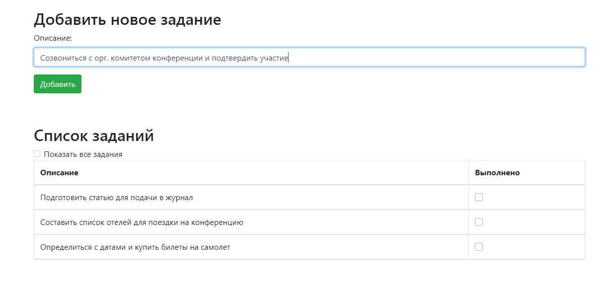
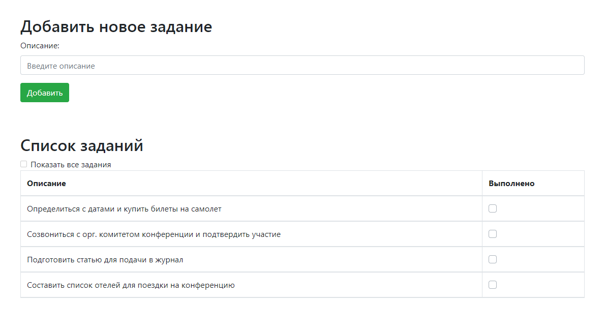
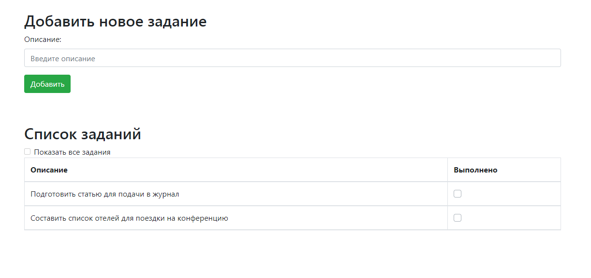
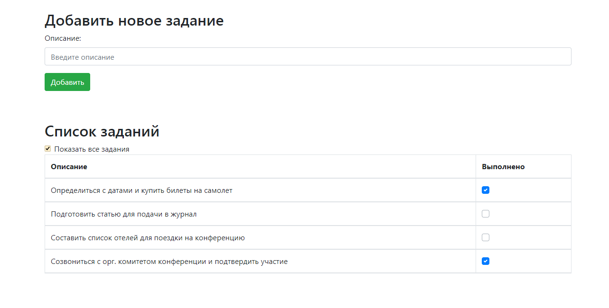

Проект "TODO список"
=====================

Проект для изучения Java EE.

Данное приложение - список дел.

Приложение имеет одну страницу со списком дел index.html.
Вверху страницы форма для добавления нового задания. 
Если дело сделано, то его отмечают, как выполненное и оно исчезает из списка.

Добавление нового задания

Список всех заданий

Отмечая задания галочками, они исчезают из списка

Список всех заданий, включая выполненные, можно увидеть установив галочку "Показать все задания"

