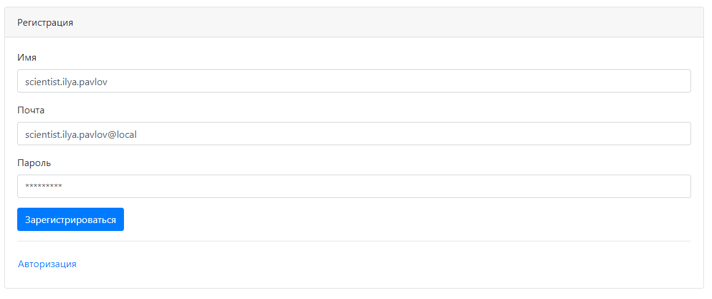
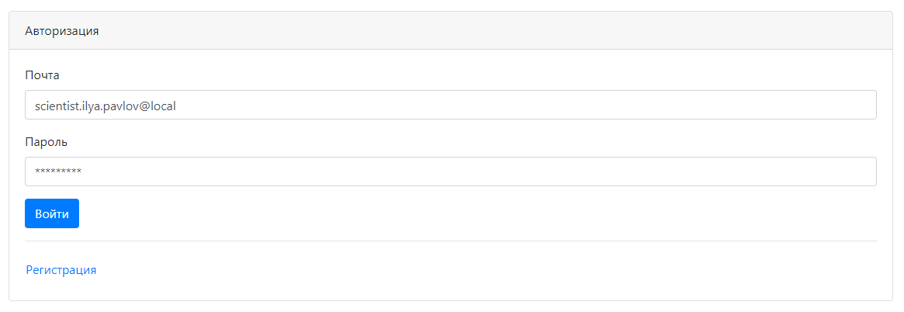
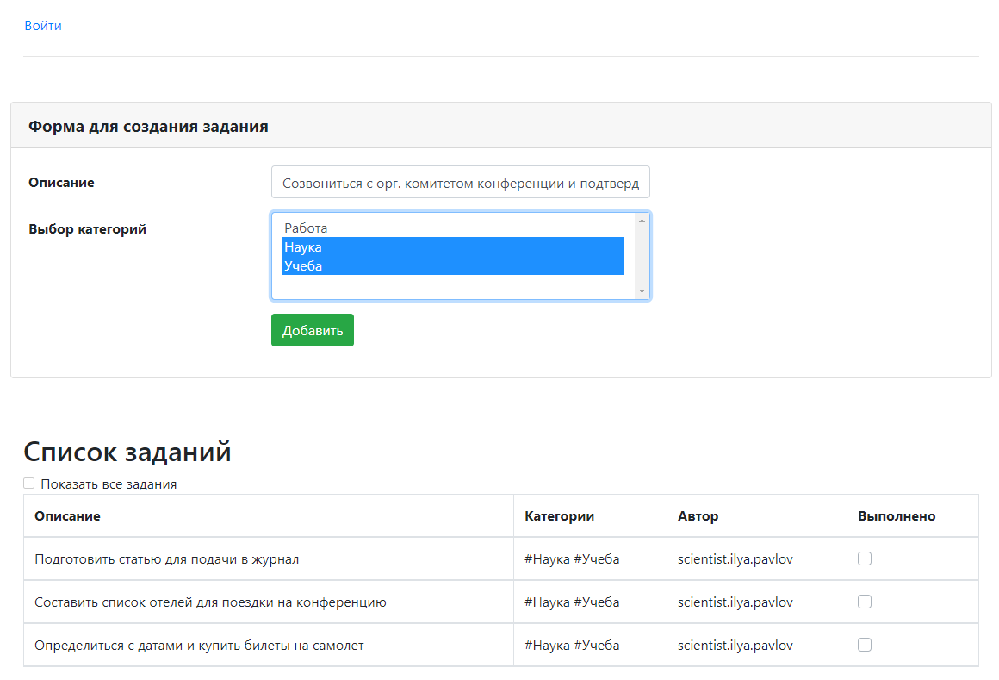
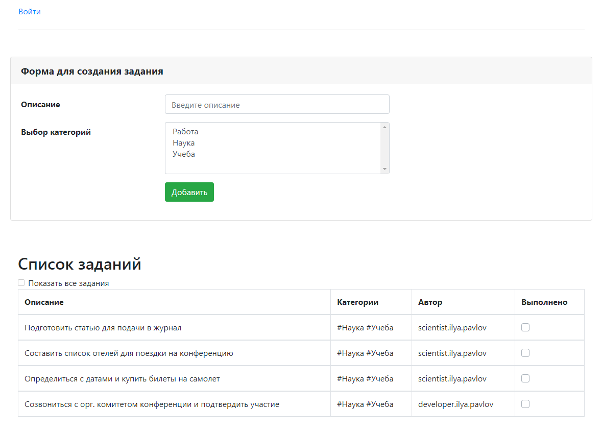
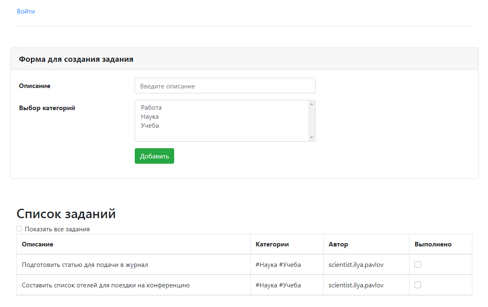
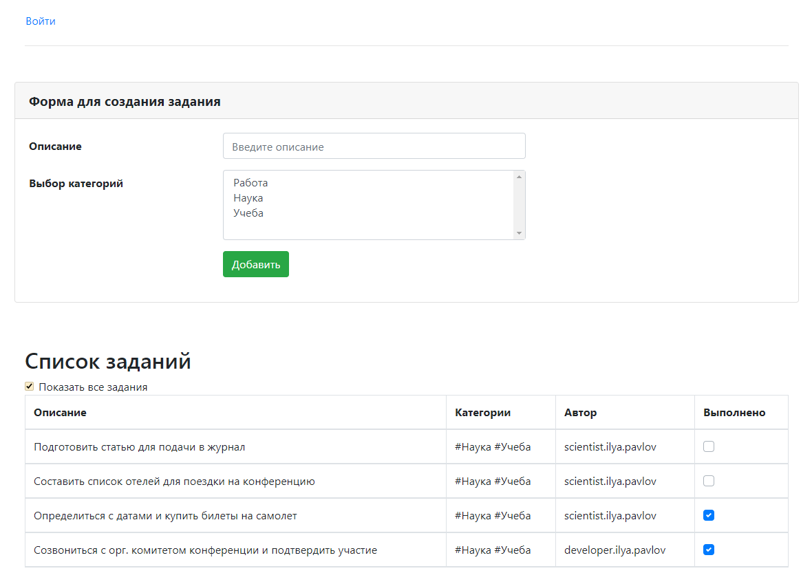

Проект "TODO список"
=====================

**О проекте:**

Проект для изучения Java EE.
Данное приложение - список дел.
Приложение имеет одну страницу со списком дел index.html.
Вверху страницы форма для добавления нового задания. 
Список всех категорий загружается на форму добавления нового задания, при этом для задания можно выбрать несколько категорий.
Если дело сделано, то его отмечают, как выполненное и оно исчезает из списка.

**Используемые технологии:**

* Java 12
* Java EE Servlets
* Tomcat
* PostgresSQL, Hibernate
* Maven
* HTML, JavaScript, Bootstrap, JSON

**Использование:**

Регистрация пользователя

Авторизация пользователя

Добавление нового задания

Список всех заданий

Отмечая задания галочками, они исчезают из списка

Список всех заданий, включая выполненные, можно увидеть установив галочку "Показать все задания"

**Контакты:**

